# Звіт: визначення марки автомобіля за фотографією

**Дисципліна:** ШІ: принципи та методи
**Виконав:** Володимир Демянчук
**Репозиторій:** https://github.com/VolodymyrDem/car-brand-classification

---

## 1. Постановка задачі

Задача — **багатокласова класифікація зображень**: за фотографією легкового автомобіля визначити його
марку (BMW, Audi, Chevrolet, ...). Вхід — кольорове RGB-зображення довільного розміру, вихід — одна з 20 марок.

Мета роботи — розв'язати задачу моделями трьох рівнів складності та порівняти їх:

| Рівень | Підхід | Модель |
|---|---|---|
| 1 | Класичне машинне навчання на ручних ознаках | Logistic Regression, Random Forest (scikit-learn) |
| 2 | Згорткова нейромережа (CNN), fine-tuning | ResNet18 (попередньо навчена на ImageNet) |
| 3 | Трансформер, fine-tuning | Vision Transformer ViT-Small/16 (ImageNet-21k → ImageNet-1k) |

Чому задача складна:

- різні моделі однієї марки можуть сильно відрізнятися (пікап і седан Chevrolet), а моделі різних
  марок — бути схожими (Chevrolet і GMC мають спільні платформи);
- фото зроблено з різних ракурсів, на різному фоні й освітленні, часто з водяними знаками;
- автомобіль займає різну частку кадру.

## 2. Дані

### 2.1. Вибір датасету

Використано **Stanford Cars** (Krause et al., 2013) — 16 185 фото, 196 класів виду
«марка + модель + рік». Датасет завантажено з дзеркала на Hugging Face (`tanganke/stanford_cars`),
оскільки оригінальні посилання Стенфорда більше не працюють. Марку виділено з назви класу
(з урахуванням багатослівних марок: *AM General*, *Aston Martin*, *Land Rover*).

### 2.2. Фільтрація класів

Після групування за марками отримано 49 марок, але більшість із них має менше 100 фото, що недостатньо
для навчання та чесного тестування. Тому залишено лише марки з **≥ 300 зображень**:

| Показник | Значення |
|---|---|
| Марок (класів) | 20 |
| Зображень | 12 681 |
| Моделей авто всередині цих марок | 153 |
| Співвідношення найбільшого / найменшого класу | 5.73 (Chevrolet / Buick) |
| Медіанний розмір фото | 640 × 426 |

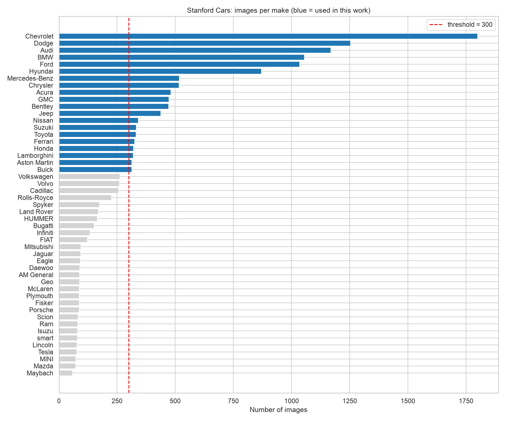

Оригінальне розбиття Stanford Cars на train/test **не використано**: обидві частини об'єднано і заново
розбито так, щоб мати окрему валідаційну вибірку. Рамки (bounding boxes) у дзеркалі відсутні, тому
фото **не обрізаються** по автомобілю — моделі бачать увесь кадр, включно з фоном. Це ускладнює задачу,
але ближче до реального застосування.

### 2.3. Розбиття train / val / test

Стратифіковане розбиття 70 / 15 / 15 % з фіксованим `seed = 42` (частка кожної марки однакова в усіх трьох частинах):

| Вибірка | Фото | Призначення |
|---|---|---|
| train | 8 876 | навчання |
| val | 1 902 | вибір гіперпараметрів / рання зупинка для нейромереж |
| test | 1 903 | **одноразова** фінальна оцінка всіх моделей |

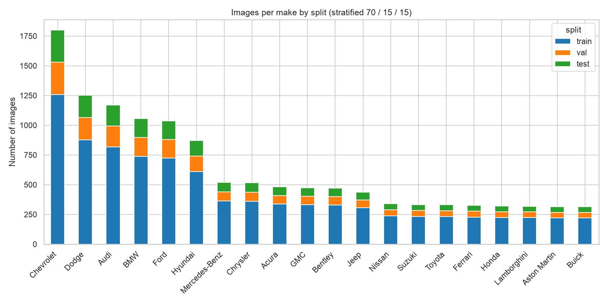

Для рівня 1 використано **стратифіковану 5-fold крос-валідацію** на train + val (10 778 фото):
кожна комбінація гіперпараметрів навчається 5 разів на 4/5 даних і оцінюється на решті 1/5.
Для нейромереж крос-валідація занадто дорога (5× час навчання на GPU), тому використано фіксовану val-вибірку.
Test-вибірка однакова для всіх моделей і не використовувалася ні для навчання, ні для вибору гіперпараметрів.

### 2.4. Аналіз даних

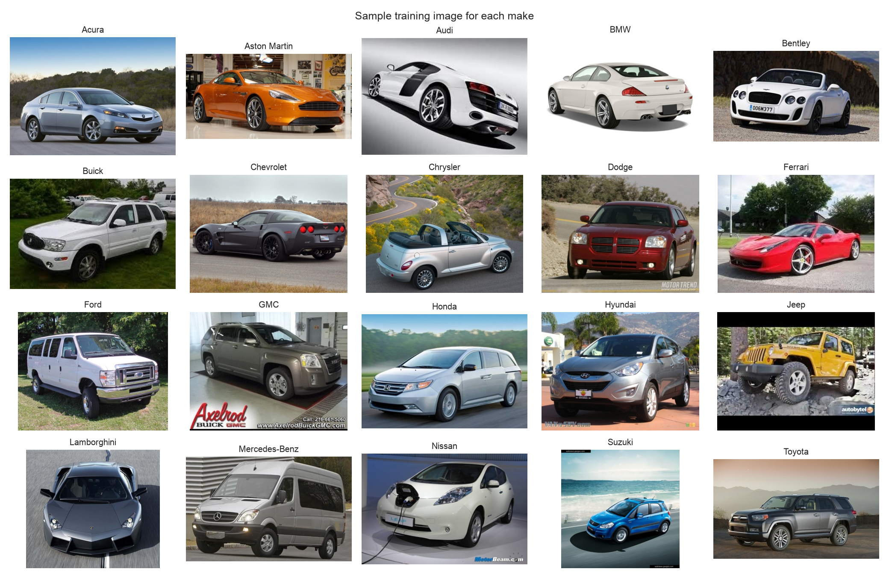

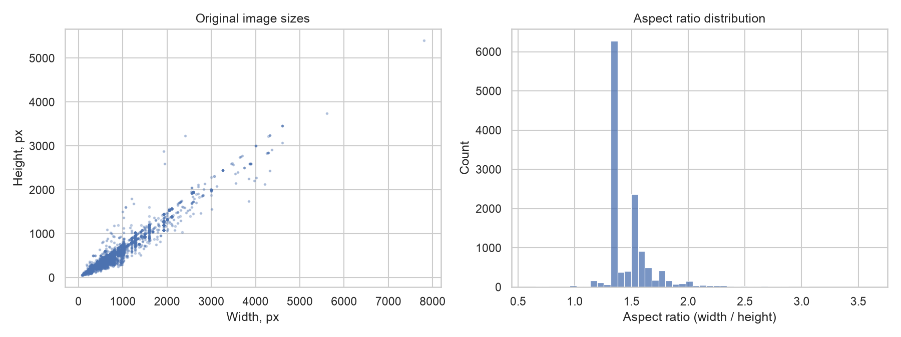

Детальний аналіз — у ноутбуці [`notebooks/01_eda.ipynb`](../notebooks/01_eda.ipynb).

## 3. Методи

### 3.1. Метрики

- **Accuracy** — частка правильних відповідей.
- **Macro F1** — середнє F1 по всіх 20 марках з однаковою вагою; **основна метрика**, бо класи незбалансовані.
- **Top-3 accuracy** — правильна марка серед трьох найімовірніших.
- Час навчання, час передбачення на одне фото, розмір моделі.

### 3.2. Рівень 1 — класичне ML (scikit-learn)

Класичні моделі не вміють працювати з пікселями напряму, тому з кожного фото витягується вектор
**ручних ознак** довжиною 2 820:

- **HOG** (Histogram of Oriented Gradients, Dalal & Triggs, 2005) — 2 772 числа: фото зменшується до
  192 × 128 у відтінках сірого, ділиться на клітинки 16 × 16, у кожній рахується гістограма 9 напрямків
  градієнтів, блоки 2 × 2 нормалізуються (L2-Hys). Описує **форму** (контури кузова, фар, решітки).
- **Гістограма кольору HSV** — 3 × 16 = 48 чисел. Описує **колір**.

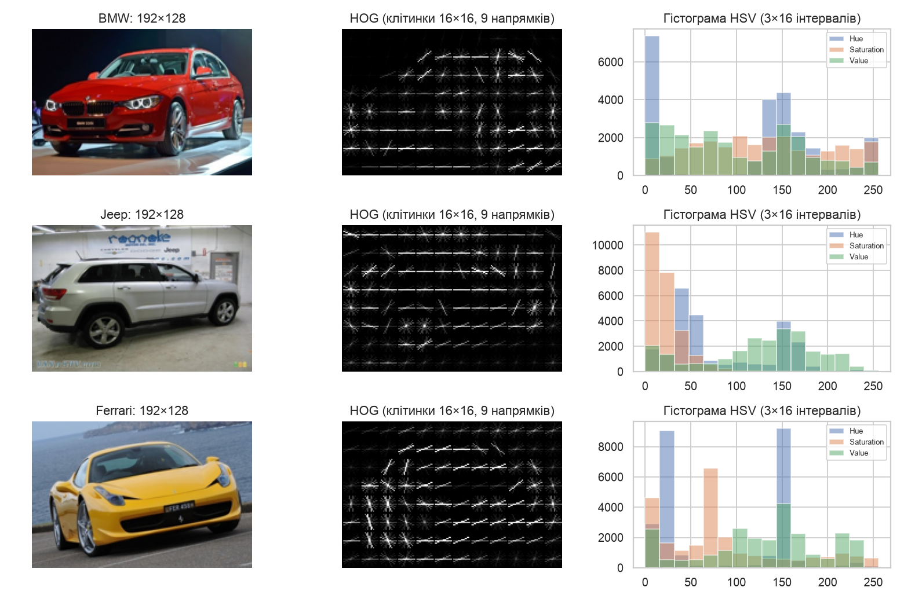

**Logistic (softmax) Regression.** Конвеєр `StandardScaler → PCA → LogisticRegression`.
PCA зменшує розмірність і прибирає шум. Сітка гіперпараметрів (12 комбінацій × 5 фолдів = 60 навчань):

| Параметр | Значення |
|---|---|
| `pca__n_components` | 128, 512 |
| `C` (обернена сила L2-регуляризації) | 0.001, 0.01, 0.1 |
| `class_weight` | None, balanced |

**Random Forest** (Breiman, 2001) — ансамбль з 300 дерев рішень. Сітка (4 комбінації × 5 фолдів):

| Параметр | Значення |
|---|---|
| `n_estimators` | 300 |
| `max_features` | sqrt, log2 |
| `class_weight` | None, balanced_subsample |

Критерій вибору — macro F1 на крос-валідації. Найкраща комбінація перенавчається на всіх 10 778 фото
і один раз оцінюється на test.

### 3.3. Рівень 2 — ResNet18

ResNet (He et al., 2015) — згорткова мережа з залишковими (skip) з'єднаннями, які дозволяють
навчати глибокі мережі. ResNet18 має 18 шарів і ~11.2 млн параметрів. Використано ваги, попередньо
навчені на ImageNet (`resnet18.a1_in1k` з бібліотеки timm), останній шар замінено на новий з 20 виходами
(**transfer learning / fine-tuning**). Мережа сама вчиться виділяти ознаки — не потрібен ручний HOG.

### 3.4. Рівень 3 — Vision Transformer

ViT (Dosovitskiy et al., 2020) ділить фото 224 × 224 на 196 патчів 16 × 16, перетворює кожен на
вектор (токен) і обробляє їх 12 блоками self-attention: кожен патч «дивиться» на всі інші, тому модель
одразу бачить глобальний контекст (на відміну від локальних згорток CNN).
Використано ViT-Small/16 (~21.7 млн параметрів), навчений на ImageNet-21k і дотренований на ImageNet-1k
(`vit_small_patch16_224.augreg_in21k_ft_in1k`).

### 3.5. Налаштування навчання нейромереж

| Параметр | ResNet18 | ViT-Small |
|---|---|---|
| Розмір входу | 224 × 224 | 224 × 224 |
| Оптимізатор | AdamW, weight decay 0.05 | AdamW, weight decay 0.05 |
| Learning rate (backbone / голова) | 1e-3 / 3e-3 | 1e-4 / 1e-3 |
| Розклад LR | warmup 1 епоха + cosine | warmup 1 епоха + cosine |
| Макс. епох | 20 | 15 |
| Batch size | 64 | 64 |
| Втрати | Cross-entropy, label smoothing 0.1 | те саме |
| Рання зупинка | 5 епох без покращення val macro F1 | те саме |

- **Заморожування:** перші 2 епохи навчається лише нова голова (backbone заморожений), щоб випадкові
  ваги голови не «зламали» попередньо навчені ознаки; далі — fine-tuning усієї мережі.
- **Аугментація** (лише train): випадкова обрізка (60–100 % площі, пропорції 1.2–1.8), горизонтальне
  віддзеркалення, зміна яскравості / контрасту / насиченості.
- Mixed precision (fp16) на GPU, зберігається модель з найкращим val macro F1.

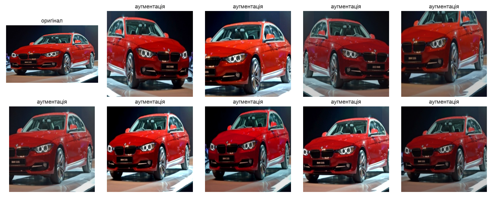

### 3.6. Середовище

- Рівні 2–3 і Logistic Regression навчено в **Google Colab** (GPU NVIDIA T4, 2 vCPU, 12.7 ГБ RAM).
- Random Forest, попередня обробка даних і EDA — локально (Apple M4 Pro, 14 ядер CPU, 24 ГБ RAM):
  на 2 vCPU Colab крос-валідація Random Forest не завершилася за 50 хв, локально вона зайняла 2 хв.
- Python 3.12, PyTorch, timm, scikit-learn, scikit-image, pytorch-grad-cam.

## 4. Результати

### 4.1. Порівняльна таблиця (test, 1 903 фото)

| Модель | Рівень | Accuracy | Top-3 | Macro F1 | Weighted F1 | Час навчання | мс / фото | Розмір, МБ |
|---|---|---|---|---|---|---|---|---|
| Logistic Regression | 1 | 20.1 % | 42.7 % | 0.162 | 0.192 | 30 с* | 0.11** | 5.7 |
| Random Forest | 1 | 17.9 % | 43.4 % | 0.084 | 0.119 | 14 с* | 0.02** | 495.9 |
| ResNet18 | 2 | 91.1 % | 97.6 % | 0.913 | 0.910 | 24.8 хв | 3.9 | 42.8 |
| **ViT-Small/16** | 3 | **92.9 %** | **98.1 %** | **0.928** | **0.929** | 19.5 хв | 3.5 | 82.7 |

Випадкове вгадування: accuracy 5 %, top-3 15 %.
\* час фінального навчання найкращої конфігурації (без урахування крос-валідації: 6.2 хв для LR, 2.1 хв для RF)
і без урахування витягування HOG-ознак (~97 с на всі фото).
\** лише класифікатор, без витягування ознак.

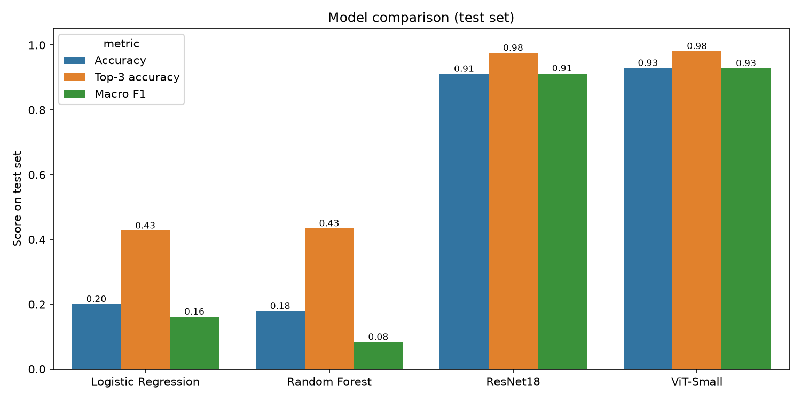

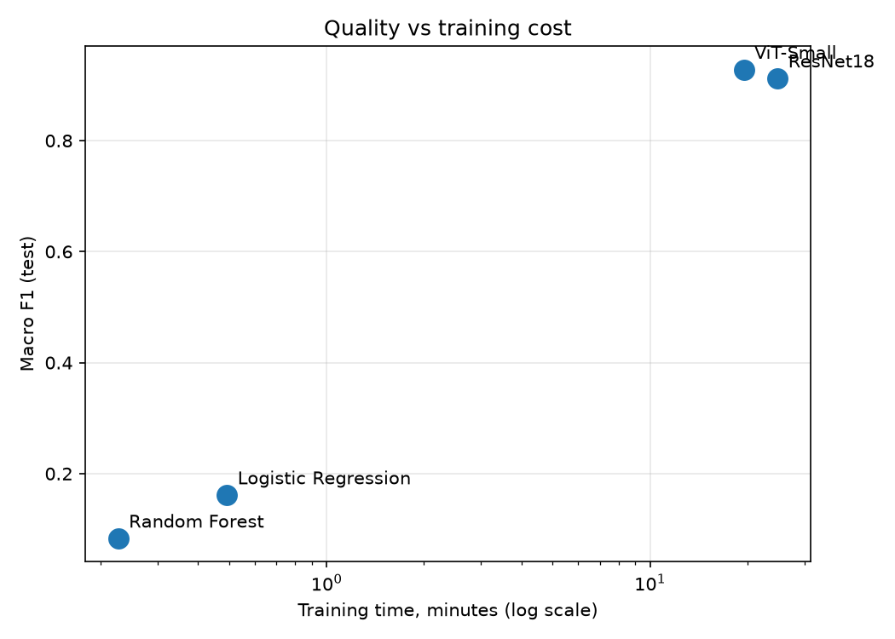

### 4.2. Рівень 1: крос-валідація

**Logistic Regression** — 12 комбінацій × 5 фолдів. Найкраща: PCA 512 компонент, `C = 0.01`, без зважування
класів; CV macro F1 = **0.168 ± 0.005**, на test — 0.162 (близько до CV, отже оцінка надійна).

| PCA | C | class_weight | CV macro F1 | train macro F1 |
|---|---|---|---|---|
| 512 | 0.01 | None | **0.168 ± 0.005** | 0.470 |
| 512 | 0.001 | balanced | 0.164 ± 0.004 | 0.384 |
| 512 | 0.001 | None | 0.162 ± 0.007 | 0.350 |
| 512 | 0.1 | None | 0.158 ± 0.005 | 0.495 |
| 128 | 0.1 | None | 0.138 ± 0.011 | 0.226 |
| 128 | 0.001 | None | 0.126 ± 0.007 | 0.186 |

512 компонент PCA стабільно кращі за 128 (більше інформації про форму). Зі зростанням `C` (слабша
регуляризація) train F1 росте, а CV F1 після `C = 0.01` падає — класичний компроміс зміщення та дисперсії.

**Random Forest** — 4 комбінації × 5 фолдів:

| max_features | class_weight | CV macro F1 | train macro F1 |
|---|---|---|---|
| sqrt | balanced_subsample | **0.086 ± 0.011** | 1.000 |
| sqrt | None | 0.074 ± 0.004 | 1.000 |
| log2 | balanced_subsample | 0.064 ± 0.005 | 1.000 |
| log2 | None | 0.058 ± 0.003 | 1.000 |

Random Forest **повністю запам'ятовує** навчальні дані (train F1 = 1.0), але погано узагальнює:
на 2 820 слабо інформативних ознаках кожне дерево бачить лише ~53 (`sqrt`) випадкові ознаки в кожному
вузлі, і ансамбль схиляється до великих класів (Chevrolet, Jeep, BMW, Audi). Через це accuracy (17.9 %)
близька до LR, а macro F1 удвічі нижчий: 8 марок із 20 мають F1 = 0. Зважування класів (`balanced_subsample`)
трохи допомагає.

### 4.3. Криві навчання нейромереж

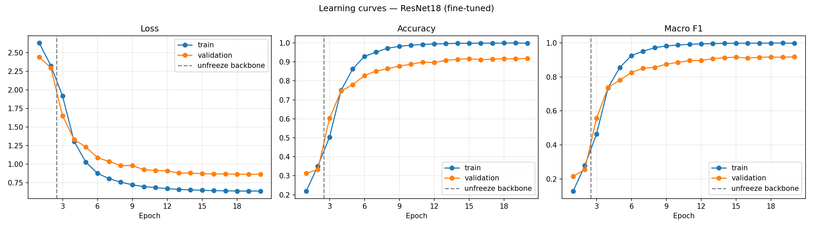

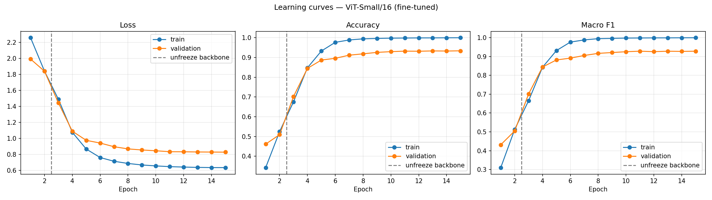

| Епоха | Фаза | ResNet18 val F1 | ViT-Small val F1 |
|---|---|---|---|
| 1 | лише голова | 0.216 | 0.432 |
| 2 | лише голова | 0.256 | 0.505 |
| 3 | fine-tuning усієї мережі | 0.557 | 0.701 |
| 5 | | 0.781 | 0.882 |
| 10 | | 0.886 | 0.926 |
| 15 | | 0.917 | 0.928 |
| 20 | | 0.918 | — |
| **Найкраща** | | **0.918 (еп. 20)** | **0.929 (еп. 11)** |

Спостереження:

- **Заморожений backbone дає мало.** Ознаки ImageNet «загального призначення» лише частково підходять для
  розрізнення марок; після розморожування (епоха 3) якість різко зростає. ViT уже на замороженому backbone
  вдвічі кращий за ResNet (0.43 проти 0.22) — його ознаки, навчені на ImageNet-21k (14 млн фото, 21 тис. класів),
  універсальніші.
- **ViT збігається швидше:** 0.88 на 5-й епосі проти 0.78 у ResNet; найкращий результат — на 11-й епосі,
  далі плато. ResNet ще повільно покращувався до 20-ї епохи.
- **Перенавчання помірне:** train accuracy ≈ 99.9–100 %, val ≈ 92–93 %. Val loss не зростає до кінця
  навчання — регуляризація (аугментація, weight decay, label smoothing) і косинусне зменшення LR
  не дають моделям «зламатися». Рання зупинка не спрацювала.
- **Test ≈ val** (ResNet: 91.1 % / 91.8 %, ViT: 92.9 % / 93.4 %) — моделі не підігнані під val-вибірку.

### 4.4. Якість по марках

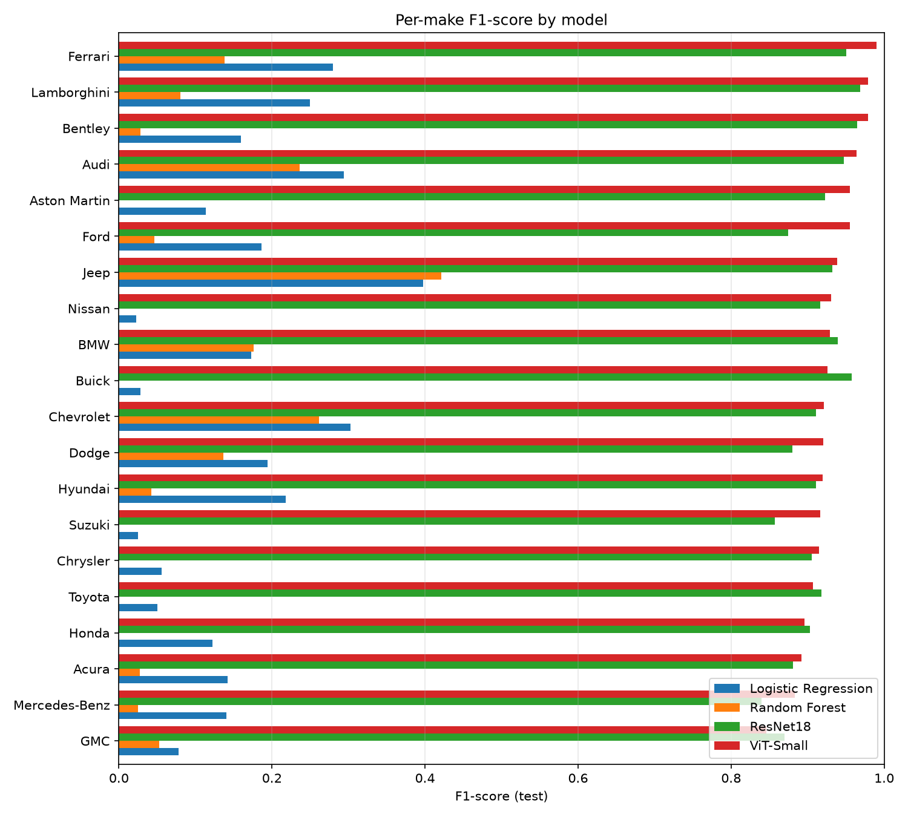

| Марка | LR | RF | ResNet18 | ViT |
|---|---|---|---|---|
| Ferrari | 0.28 | 0.14 | 0.95 | **0.99** |
| Lamborghini | 0.25 | 0.08 | 0.97 | **0.98** |
| Bentley | 0.16 | 0.03 | 0.97 | **0.98** |
| Audi | 0.29 | 0.24 | 0.95 | **0.96** |
| … | | | | |
| Toyota | 0.05 | 0.00 | **0.92** | 0.91 |
| Mercedes-Benz | 0.14 | 0.03 | 0.84 | **0.88** |
| GMC | 0.08 | 0.05 | **0.87** | 0.85 |

Повна таблиця — `reports/tables/per_class_f1.csv`.

- **Найлегші — суперкари і люкс** (Ferrari, Lamborghini, Bentley, Aston Martin): унікальний дизайн,
  мало схожих моделей у інших марок.
- **Найважчі — GMC, Mercedes-Benz, Acura, Honda, Toyota**: масові авто з «типовими» кузовами (седани, SUV, фургони),
  а GMC майже повністю дублює моделі Chevrolet.
- Для класичних моделей найкращі — Jeep (0.40) і Chevrolet (0.30): у Jeep характерні квадратні SUV-форми,
  які HOG добре описує, а Chevrolet — найбільший клас.

### 4.5. Матриці помилок

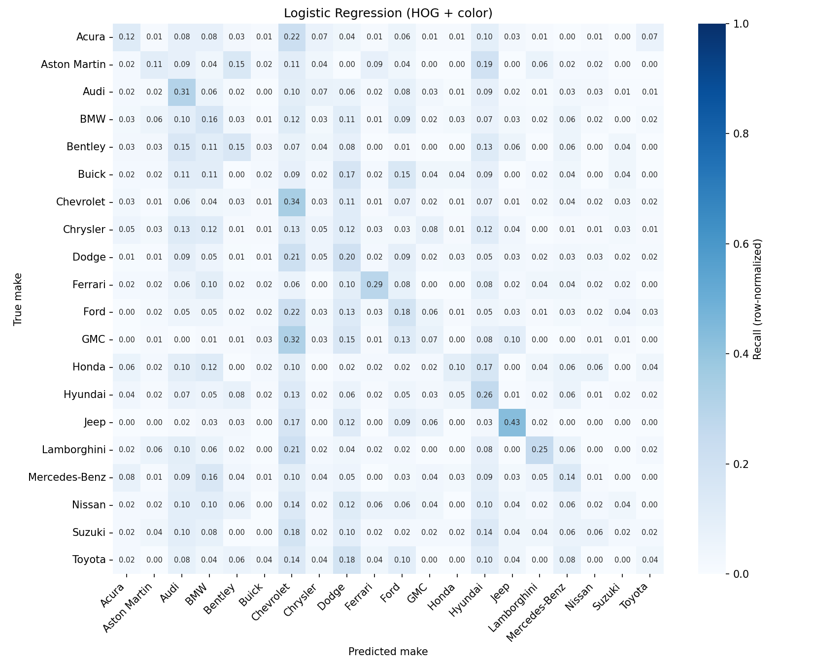


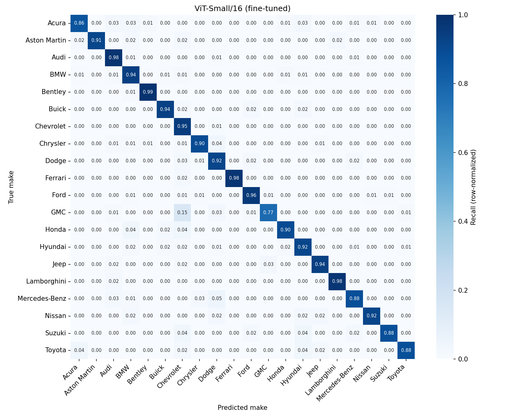

Найчастіші помилки на test:

| ResNet18: істинна → передбачена | К-сть | ViT-Small: істинна → передбачена | К-сть |
|---|---|---|---|
| Dodge → Ford | 8 | **GMC → Chevrolet** | **11** |
| Acura → Chevrolet | 6 | Dodge → Chevrolet | 5 |
| Chevrolet → BMW | 6 | Dodge → Ford | 4 |
| Dodge → Chevrolet | 6 | Mercedes-Benz → Dodge | 4 |
| Chevrolet ↔ GMC | 5 + 5 | Dodge → Mercedes-Benz | 4 |

- **GMC ↔ Chevrolet** — найзрозуміліша помилка: обидві марки належать General Motors і продають
  однакові авто під різними іменами (Chevrolet Silverado ≈ GMC Sierra, Chevrolet Express ≈ GMC Savana).
  Різниця — лише решітка радіатора і логотип.
- **Dodge ↔ Mercedes-Benz** — фургон Dodge Sprinter є перейменованим Mercedes-Benz Sprinter.
- **Dodge ↔ Chrysler / Ford / Chevrolet** — американські пікапи, мінівени та седани схожих пропорцій.

Тобто більшість помилок нейромереж — це випадки, де марки **справді майже не відрізняються** візуально.

### 4.6. Інтерпретація: куди дивляться моделі

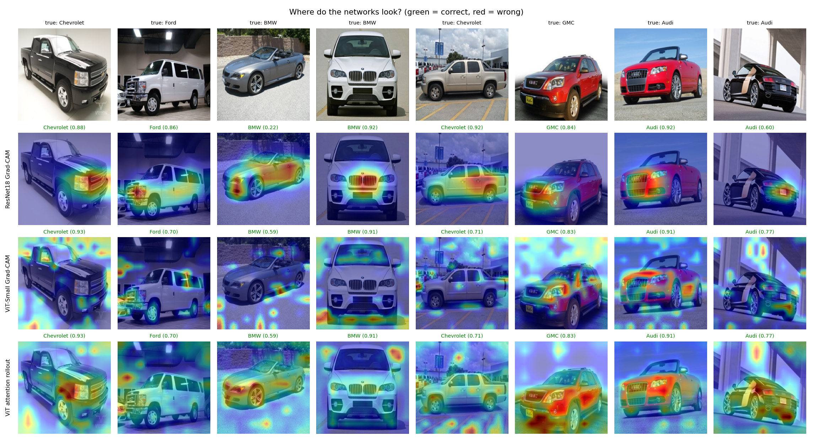

- **Grad-CAM** (Selvaraju et al., 2017) показує, які ділянки фото найбільше вплинули на передбачення.
- **Attention rollout** (Abnar & Zuidema, 2020) показує, на які патчі дивиться токен класу ViT.

Усі 8 прикладів класифіковано правильно обома моделями. Що видно на картах:

- **ResNet18** зосереджується на **передній частині авто**: решітка радіатора BMW (характерні «ніздрі»),
  решітка й логотип Audi, фари та решітка Chevrolet Silverado, задні ліхтарі Audi R8. Тобто мережа сама
  навчилася дивитися саме на ті деталі, якими дизайнери відрізняють марки, — без жодної розмітки цих деталей.
- **ViT attention rollout** також підсвічує передок і фари (Chevrolet, Audi A4, GMC), але увага ширша —
  охоплює весь кузов, що відповідає глобальній природі self-attention.
- **Grad-CAM для ViT** шумніший і менш інформативний (плями на фоні) — цей метод створено для CNN, і для
  трансформерів attention rollout краще пояснює рішення моделі.
- На фото, де видно кілька авто (Chevrolet Avalanche на стоянці дилера), карти частково «розтікаються»
  на сусідні машини — наслідок відсутності обрізки по bounding box.

**Найвпевненіші помилки** (нижче) підтверджують аналіз матриць помилок: ViT із впевненістю 0.72–0.95 плутає
фургони **GMC Savana і Chevrolet Express** (це одне й те саме авто з різними значками), а також
**Dodge Sprinter і Mercedes-Benz Sprinter**. Решта помилок — мінівени й SUV схожих пропорцій,
сфотографовані збоку або ззаду, де решітки радіатора не видно.

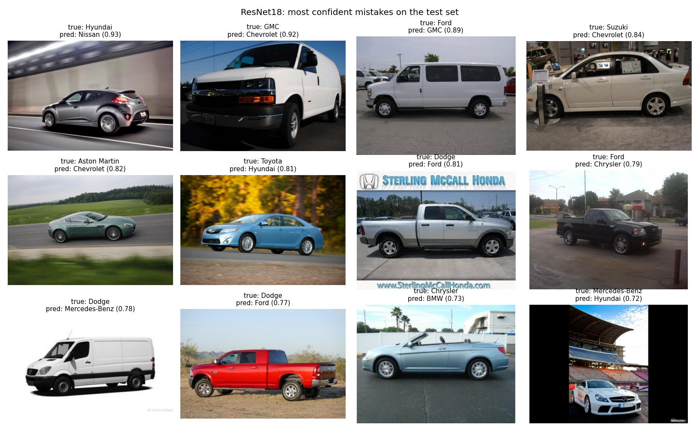

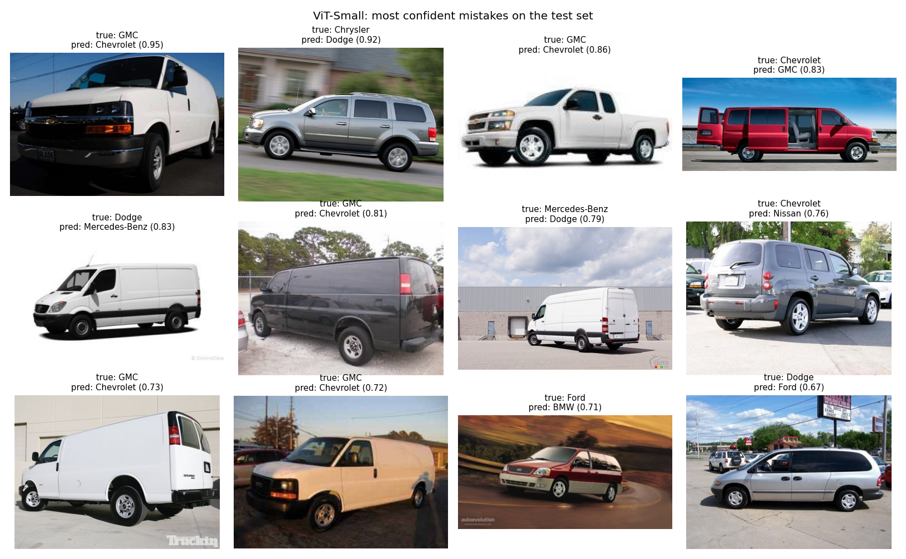

## 5. Обговорення

**Класичне ML vs нейромережі.** Розрив величезний: 0.16 проти 0.91–0.93 macro F1. Причина — в ознаках.
HOG на фото 192 × 128 з клітинками 16 × 16 описує **загальний силует**, який більше залежить від типу
кузова (седан / SUV / пікап) і ракурсу, ніж від марки. Дрібні деталі, що насправді визначають марку
(форма решітки, фар, логотип), займають кілька пікселів і губляться. Гістограма кольору майже не допомагає:
колір авто не залежить від марки. Крім того, на фото є фон, водяні знаки й інші машини.
Тобто для цієї задачі «ручні» ознаки — вузьке місце, і жоден класифікатор поверх них (лінійний чи ансамбль
дерев) не дає високої якості. Логістична регресія при цьому краща за Random Forest: на 2 820 шумних
ознаках проста лінійна модель з L2-регуляризацією і PCA узагальнює краще, ніж дерева, які запам'ятовують шум.

**Transfer learning.** Нейромережі вчать ознаки самі, і, головне, починають не з нуля: вони вже
навчені на мільйонах фото ImageNet (серед класів якого є різні типи авто). Fine-tuning лише адаптує ці
ознаки до 20 марок, тому ~9 тис. навчальних фото достатньо для 91–93 % accuracy за 20–25 хв на T4.

**ResNet18 vs ViT-Small.** ViT кращий на 1.8 п.п. accuracy і 1.5 п.п. macro F1, збігається швидше
(найкраща епоха 11 проти 20) і навчався навіть швидше за wall-clock (19.5 хв проти 24.8 хв: менше епох;
в обох випадках вузьке місце — 2 vCPU Colab, що декодують і аугментують фото, тому одна епоха займала ~75 с
для обох моделей). Перевага ViT пояснюється:
1) **глобальною увагою** — кожен патч бачить усе фото, тому модель одразу пов'язує форму фар, решітки
й силуету; 
2) **сильнішим попереднім навчанням** (ImageNet-21k проти ImageNet-1k у ResNet).
Ціна — удвічі більше параметрів (21.7 млн проти 11.2 млн) і розмір файлу (83 МБ проти 43 МБ);
швидкість передбачення на GPU практично однакова (~3.5–3.9 мс / фото).

Моделі помиляються на **різних** фото: ResNet помиляється на 170 фото, ViT — на 135, а обидві одночасно —
лише на 71. Простий ансамбль (середнє ймовірностей двох моделей) дає **94.1 %** accuracy на test —
більше за кожну окремо. У звіті це наведено як можливе покращення, а не як окрему модель.

**Дисбаланс класів.** Для нейромереж macro F1 ≈ accuracy, тобто вони майже однаково добре працюють
на великих і малих класах. Для класичних моделей macro F1 значно нижчий за accuracy — вони зміщені
у бік великих класів.

**Обмеження роботи:**
- немає обрізки по автомобілю (bounding boxes відсутні в дзеркалі датасету) — модель бачить фон;
- лише 20 марок і авто до 2012 модельного року (Stanford Cars), переважно американський ринок;
- для нейромереж — одне розбиття і один запуск (без крос-валідації та кількох seed) через обмеження GPU-часу,
  тож різниця ResNet vs ViT у 1–2 п.п. може частково залежати від випадковості;
- Random Forest навчався на іншому обладнанні (Apple M4 Pro, 14 ядер), бо на 2 vCPU Colab крос-валідація
  не завершилася за 50 хв, — час навчання рівня 1 не напряму порівнюваний з рівнями 2–3.

**Можливі покращення:** обрізка авто детектором (наприклад, YOLO) перед класифікацією; вища роздільність
(деталі логотипу); більші моделі (ResNet50, ViT-Base, ConvNeXt); test-time augmentation; ансамбль моделей.

## 6. Висновки

1. Побудовано три рівні моделей для визначення марки авто за фото (20 марок, 12 681 фото, стратифіковане
   розбиття 70/15/15).
2. **Рівень 1** (HOG + колір → Logistic Regression / Random Forest, 5-fold CV): accuracy 20.1 % / 17.9 %,
   macro F1 0.162 / 0.084. Це у 3–4 рази краще за випадкове вгадування, але недостатньо для практики:
   ручні ознаки не захоплюють дрібних деталей, що відрізняють марки.
3. **Рівень 2** (ResNet18, fine-tuning): accuracy **91.1 %**, macro F1 **0.913** — у 4.5 рази краще за рівень 1.
4. **Рівень 3** (ViT-Small, fine-tuning): accuracy **92.9 %**, top-3 **98.1 %**, macro F1 **0.928** — найкращий
   результат, швидша збіжність, але вдвічі більша модель.
5. Складність моделі виправдана: перехід від ручних ознак до навчених (рівень 1 → 2) дає основний приріст
   (+71 п.п. accuracy), перехід від CNN до трансформера (2 → 3) — менший, але стабільний (+1.8 п.п.).
6. Основні помилки нейромереж — між марками, що продають візуально однакові авто (GMC/Chevrolet,
   Dodge/Mercedes-Benz Sprinter), тобто це обмеження самої задачі, а не лише моделей.

## 7. Як відтворити

```bash
pip install -r requirements.txt
python scripts/prepare_data.py          # завантаження і розбиття даних
python scripts/eda.py                   # графіки EDA
python scripts/train_classical.py       # рівень 1
python scripts/train_deep.py --model resnet18    # рівень 2 (GPU)
python scripts/train_deep.py --model vit_small   # рівень 3 (GPU)
python scripts/compare.py               # порівняльна таблиця і графіки
python scripts/interpret.py             # Grad-CAM, attention rollout, аналіз помилок
```

Або все одразу в Colab: [`notebooks/colab_train.ipynb`](../notebooks/colab_train.ipynb).

## 8. Джерела

1. Krause J., Stark M., Deng J., Fei-Fei L. *3D Object Representations for Fine-Grained Categorization.* ICCV Workshops, 2013.
2. Dalal N., Triggs B. *Histograms of Oriented Gradients for Human Detection.* CVPR, 2005.
3. Breiman L. *Random Forests.* Machine Learning, 45(1), 2001.
4. He K., Zhang X., Ren S., Sun J. *Deep Residual Learning for Image Recognition.* arXiv:1512.03385, 2015.
5. Dosovitskiy A. et al. *An Image is Worth 16x16 Words: Transformers for Image Recognition at Scale.* arXiv:2010.11929, 2020.
6. Steiner A. et al. *How to train your ViT? Data, Augmentation, and Regularization in Vision Transformers.* arXiv:2106.10270, 2021.
7. Selvaraju R. et al. *Grad-CAM: Visual Explanations from Deep Networks via Gradient-based Localization.* ICCV, 2017.
8. Abnar S., Zuidema W. *Quantifying Attention Flow in Transformers.* ACL, 2020.
9. Wightman R. *PyTorch Image Models (timm).* https://github.com/huggingface/pytorch-image-models
